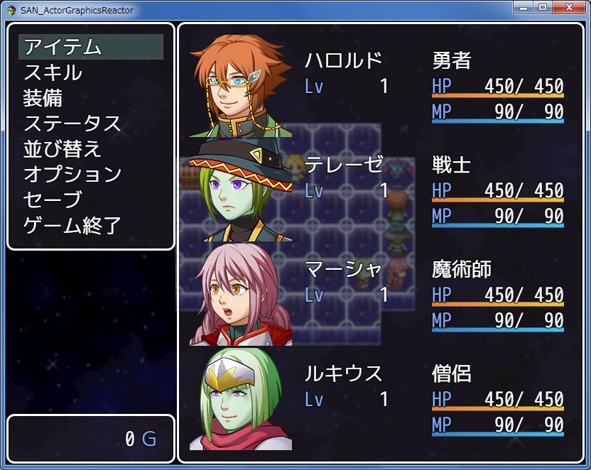
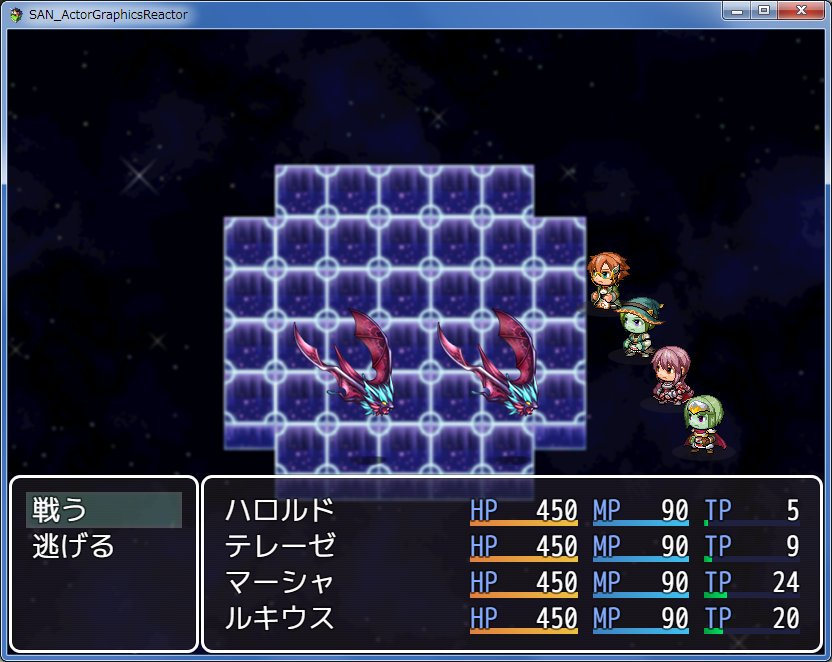
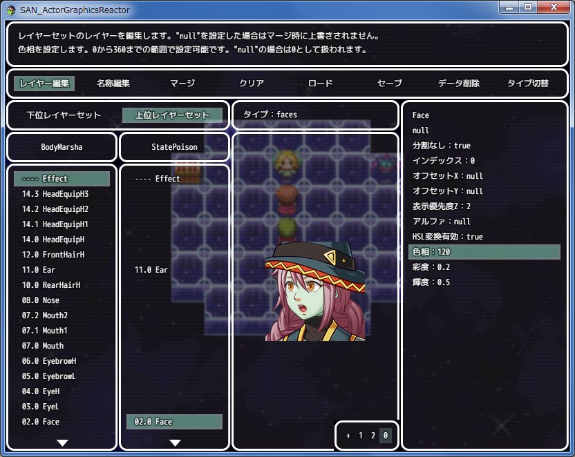
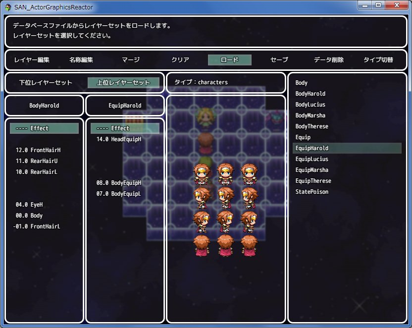

# SAN_ActorGraphicsReactor
このスクリプトはRPGツクールMV向けプラグインです。

## 概要
このプラグインはアクターの状態に応じてキャラクターのグラフィックを変化させる機能を追加します。
このプラグインは次の機能を提供します。

- アクターへのグラフィック反映機能  
アクターの歩行、顔、立ち絵、サイドビューバトラーグラフィックに
職業、装備、スキル、ステートを反映する機能です。

- イベントへのグラフィック反映機能  
アクターのグラフィックをイベントに反映する機能です。

- アクターの立ち絵表示機能  
アクターに立ち絵を設定してピクチャ状に表示する機能です。

- データ編集機能  
グラフィック反映機能のレイヤーセットデータを編集する機能です。

## デモ  
- 装備とステートによるグラフィックの変化
  
  
- グラフィックレイヤーセットデータの編集
  
  
- Twitterリンク（動画）  
[立ち絵表示デモ1](https://twitter.com/rev2nym/status/821631446930653184)  
[立ち絵表示デモ2](https://twitter.com/rev2nym/status/821649589019308032)  

## 利用規約
MITライセンスのもと、商用利用、改変、再配布が可能です。
ただし冒頭のコメントは削除や改変をしないでください。
これを利用したことによるいかなる損害にも作者は責任を負いません。
サポートは期待しないでください＞＜。
